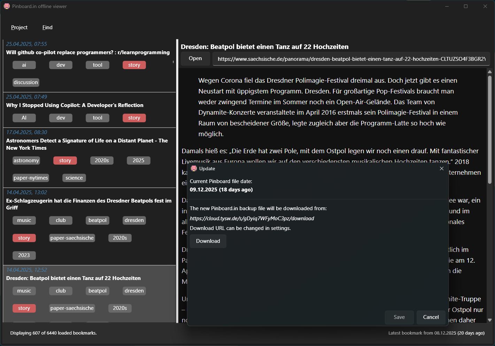
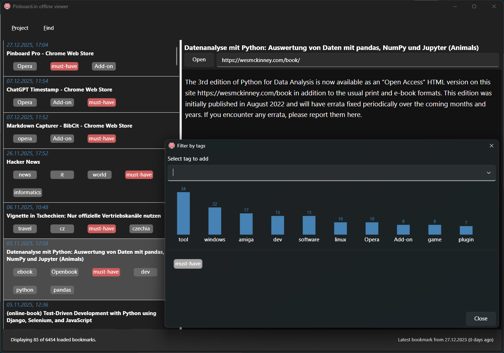
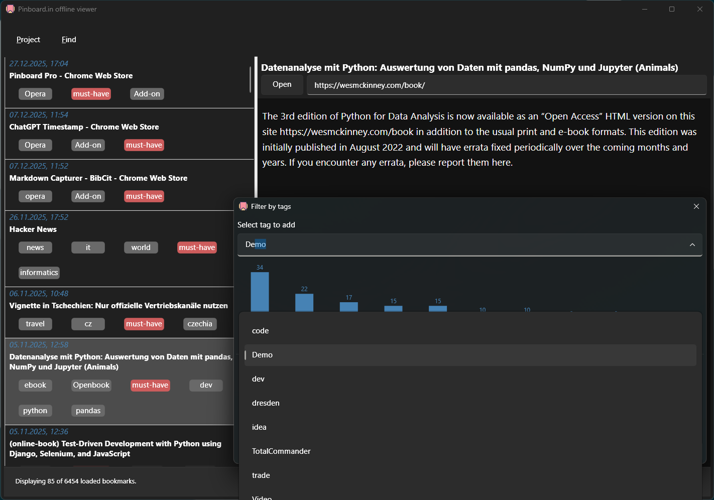

# About

This tool allows to view the `JSON` backup of a [Pinboard.in](pinboard.in)
account offline. Pinboard.in is a cloud-based bookmark service I use for many
years. I felt the need for it because over the years my bookmarks grow more into
a *knowledge base* kind of thing, and I used the description field for bookmarks
more frequently and extensively. Additionally, I started writing *Markdown* into 
this field and this is not rendered by Pinboard web client.

So, I started writing this tool which is in its early state and at the moment
has these features:

- .NET9.0 app with WPF/FluentDesign that adapts well to switching between dark
  and light themes, which is done on my Windows system using the third-party
  tool [AutoDarkMode](https://github.com/AutoDarkMode/Windows-Auto-Night-Mode).
- Allows download of the JSON backup file from a cloud share
- Displays the bookmarks and renders them in Markdown
- Supports tag filtering

## Screenshot of the download/update window

## Screenshots of the tag filter window

# Known issues

- In tag window I use a custom Combobox control that doesn't work well with the
  *FluentDesign*. So said, it loses its `Virtualization` ability and is slow when
  many tags are in the Pinboard file. I have that on my list.
